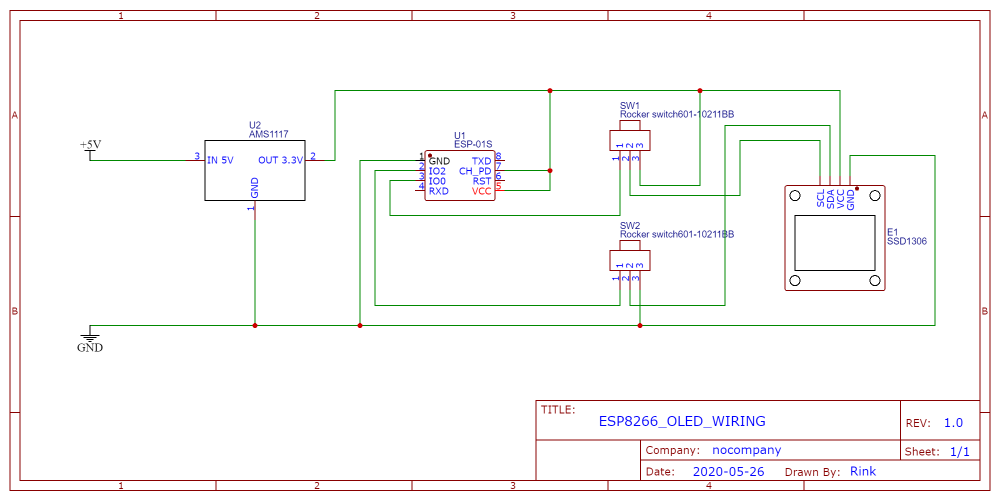
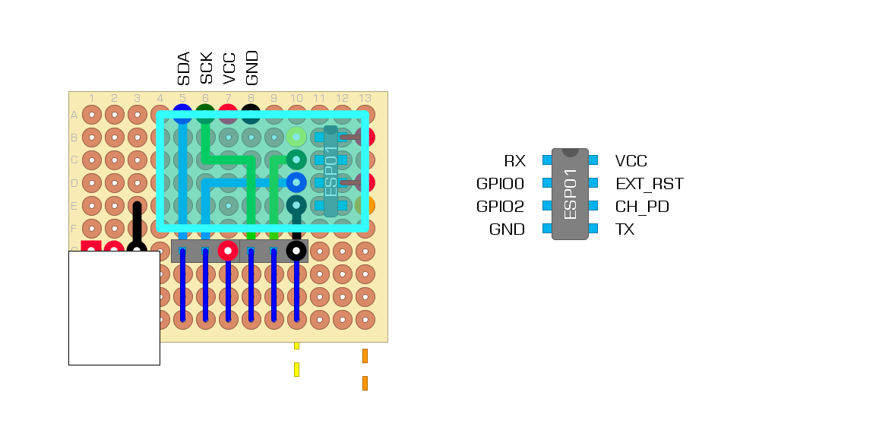

# ESP8266exOLED
ESP-01 OLED control.


# Including custom images and animations
Open a terminal in the `script` folder and run the following commands.

## Convert images to header files
```
python3 make_splash_folder.py
```
Will convert all images in the `./script/img` folder to header files and put these in the `./include/data_img` dir. Script will threshold and binarize the image, trim whitespace, and resize to the size of the display in pixels. 

## Convert animated gif to header file 

```
python3 make_splash_anim.py
```
Will convert all gifs in the `./script/anim` folder to header files and put these in the `./include/data_anim` dir. Script will threshold and binarize the gif frames, trim whitespace, and resize to the size of the display in pixels. 


## Generate C++ code to display images and animations

```
python3 create_cpp_code.py
```
Will generate c++ code to draw all the images and animations. Including function pointer arrays, to randomly draw one of the images/animations. 

# Schematic

The rocker switches allow to switch between normal functioning and programming mode. To put the ESP-01 in programming mode, connect GPIO0 to 3.3V and GPIO2 to GND. Then reboot the ESP-01 by momentarily disconnecting the power supply. 

Small footprint prototyping pcb layout


# Todos
- Rewrite img to header conversion procedure. Directly write (preferably compressed) binary files that can be uploaded to the ESP-01. Then use the file system (`SPIFFS` or `LittleFS`) to browse img/animation, uncompress data and draw on OLED display. 